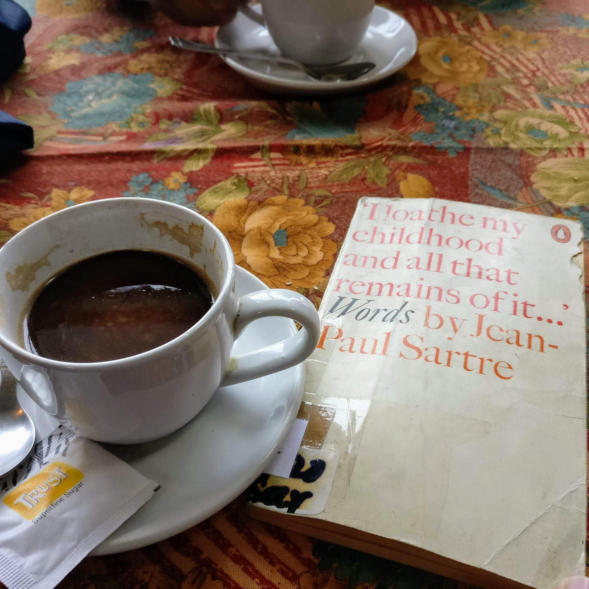

**a·nach·ro·nis·tic**
belonging to a period other than that being portrayed.
"'Titus' benefits from the effective use of anachronistic elements like cars and loudspeakers"
belonging or appropriate to an earlier period, especially so as to seem conspicuously old-fashioned.
"she is rebelling against the anachronistic morality of her parents"

---

**fer·ret**
look around in a place or container in search of something.
"he went to the desk and ferreted around"

---

**con·spic·u·ous**
standing out so as to be clearly visible.
"he was very thin, with a conspicuous Adam's apple"
attracting notice or attention.
"he showed conspicuous bravery"

---
**se·vere**
intense

---
**prec·i·pice**
We’re at the precipice of all of these really big ideas.

---

**frail·​ty **
the state of being weak in health or body or moral weakness
Representative of the sympathies and frailties of human nature